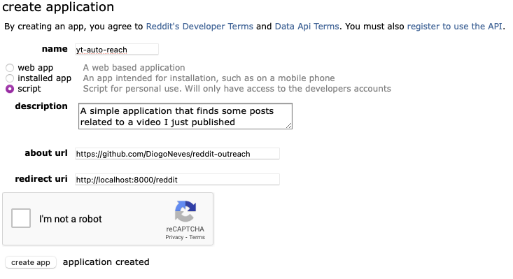

# Reddit Outreach

> A simple tool to find Reddit posts that would benefit from sharing a specific YouTube video.

## Features

### Main Features

- **Generate Comments:** Automatically generate relevant comments to publicize your YouTube video based on how relevant your video is to the posts.
- **Multi-step LLM Calls:** Utilize multiple steps of language model calls to analyze posts and generate engagement content.
- **Reddit API Integration:** Use the Reddit API to search for posts and comments to find the best opportunities for outreach.

### Technical Features

- **Caching:** Implemented caching mechanism to save intermediate results and improve performance.
- **Parallel Processing:** Efficiently handle multiple asynchronous tasks to speed up processing.
- **Simple OpenAI Calls:** Easy integration with OpenAI's API for natural language processing.

### Sample Output

This is a single comment generated by the tool, for one of my videos:

```markdown
Post Title: How do I use HuggingFace?  
Generated Comment: Hey there! I totally understand the confusion around MMPROJ files and running AI models.  
While I might not have specific information on MMPROJ files, I recently created a video titled "How to
Run Local AI Models - in 5 minutes" that covers the basics of running local AI models, which might help you
get started! You can check it out here:
[How to Run Local AI Models - in 5 minutes](https://www.youtube.com/watch?v=Zcp4rAWbyjk).
I hope it provides some useful insights, and if you have any questions after watching, feel free to ask!  
Post URL: https://www.reddit.com/r/SillyTavernAI/comments/1ct56vy/how_do_i_use_huggingface/
```

## Setup

### Prerequisites

- Python 3.11+
- pip (upgrade with \`pip install --upgrade pip\` recommended)
- Reddit account and app setup

### Installation

1. Clone the repository:

    ```sh
    git clone https://github.com/yourusername/reddit-outreach.git
    cd reddit-outreach
    ```

2. Create a virtual environment:

    ```sh
    python -m venv .venv
    source .venv/bin/activate  # On Windows, use `venv\Scripts\activate`
    ```

3. Install the required packages:

    ```sh
    pip install -r requirements.txt
    ```

### Configuration

Create a Reddit app at [prefs/apps/](https://www.reddit.com/prefs/apps/). Set the app's redirect URI to `http://localhost:8000`.

**Create a .env file in the root directory with the following content:**

```sh
export REDDIT_CLIENT_ID="your_client_id"
export REDDIT_CLIENT_SECRET="your_client_secret"
export REDDIT_USER_AGENT="your_user_agent"
export REDDIT_REDIRECT_URI="http://localhost:8000"
```

These are the settings I used for my app:


## Usage

```sh
# Using my video
python outreach.py "https://www.youtube.com/watch?v=bF7WnLk5ix4"
```

## Contributing

Contributions are welcome! PRs, issues, and feedback are appreciated.

## License

[MIT License](LICENSE)
